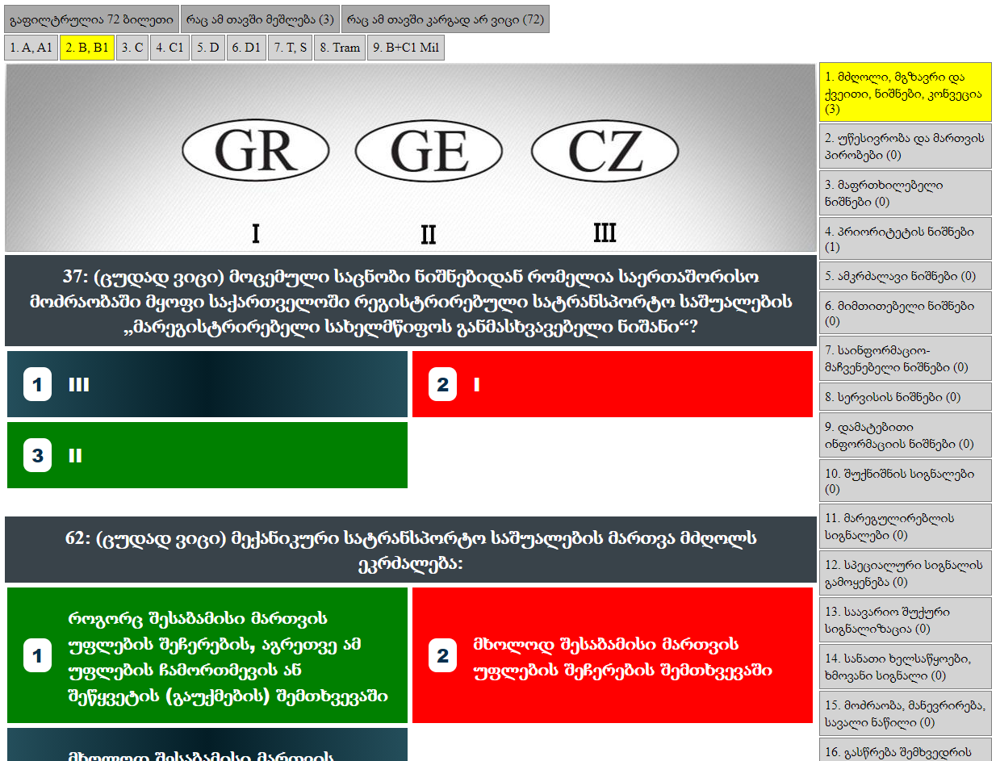

# მართვის მოწმობის მასწავლებელი
აპლიკაცია იმახსოვრებს ბილეთებს რომელშიც იჭრებით და იძლევა ცალკე დაფილტვრის საშუალებას, ნასწავლ ბილეთად თვლის ისეთ ბილეთს რომელზეც სხვადასხვა დროს 3-ჯერ ზედიზედ სწორად გაეცით პასუხი, ასევე თვალსაჩინოდ ასახავს თავების სწავლის პროცესს სხვადასხვა ინდიკატორებით. **როდესაც ყველა თავის ქვეშ ყველა პროგრესბარი მთლიანად გამწვანდება შეგიძლიათ თამამად გახვიდეთ გამოცდაზე.**

ონლაინ ვერსია: https://hazardland.github.io/drive.vue/



## Setup
```
npm install
npm run serve
npm run build
```
